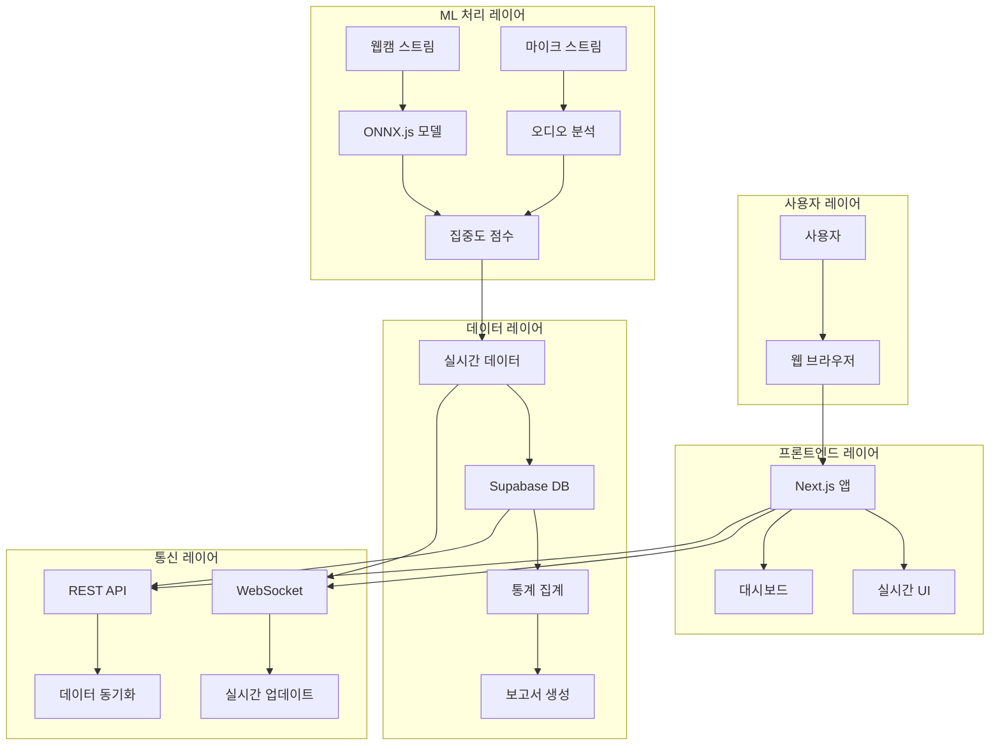
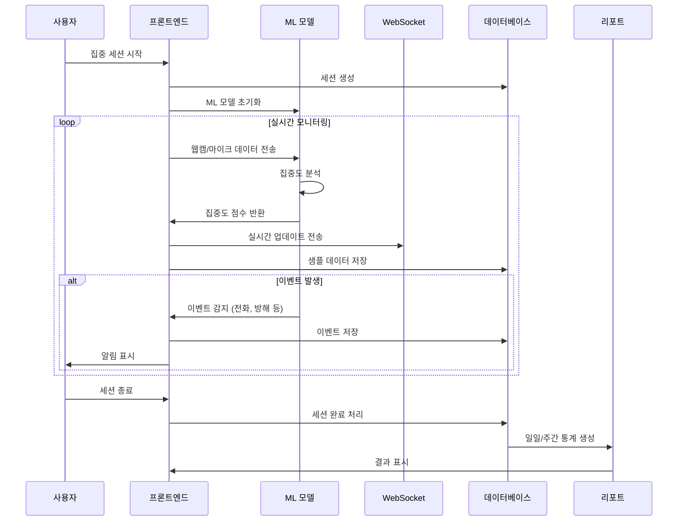
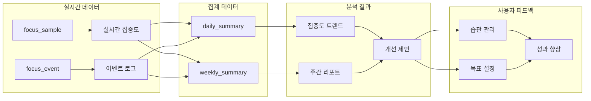
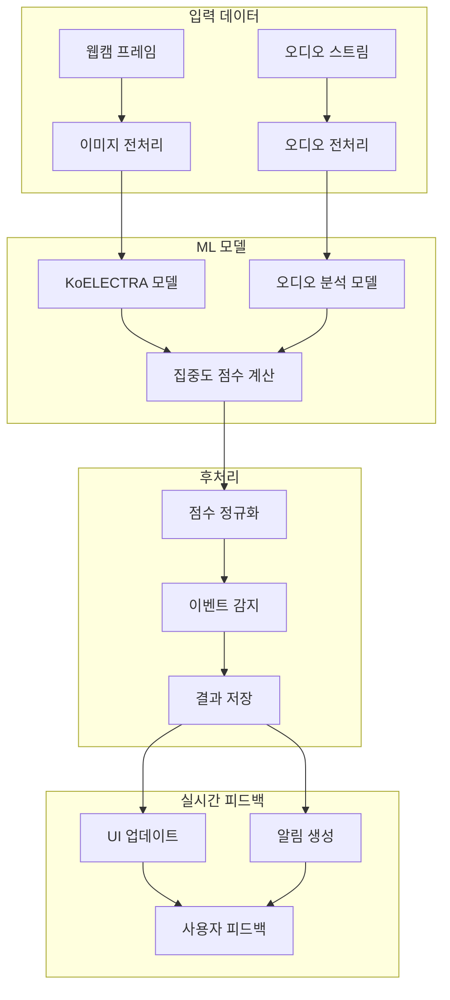
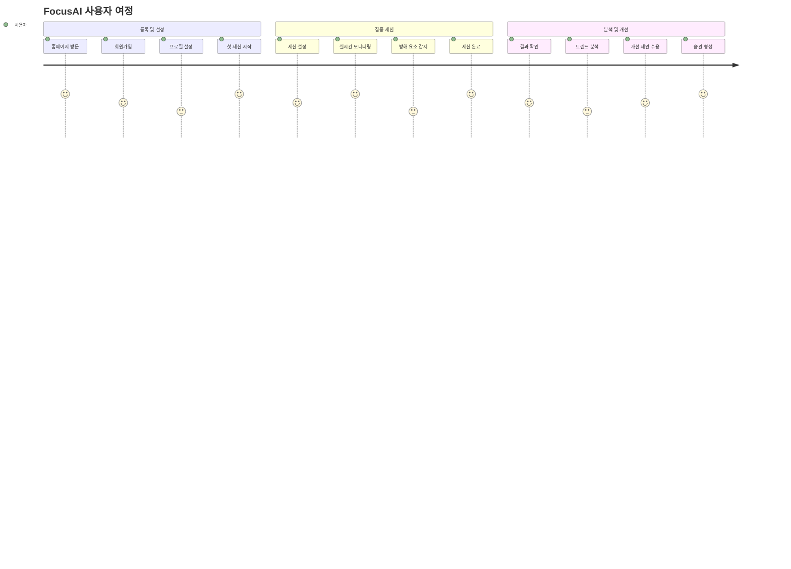
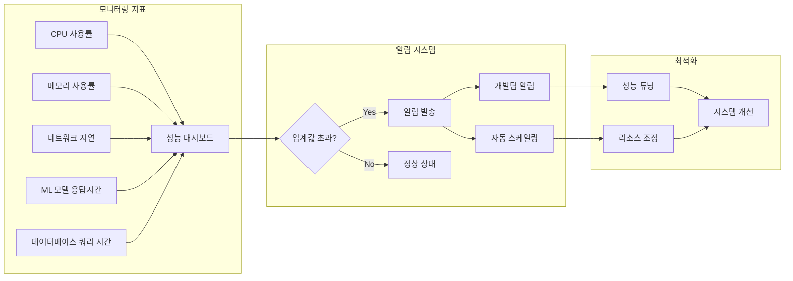

# FocusAI 데이터 플로우 다이어그램

## 1. 전체 시스템 아키텍처

## 2. 집중 세션 데이터 플로우

## 3. 데이터 저장 및 분석 플로우

## 4. ML 파이프라인 데이터 플로우

## 5. 사용자 경험 플로우

## 6. 시스템 성능 모니터링 플로우

## 사용 방법

### 1. Mermaid Live Editor
- https://mermaid.live/ 접속
- 위의 코드를 복사하여 붙여넣기
- 실시간으로 다이어그램 확인
- PNG, SVG 등으로 export

### 2. GitHub/GitLab
- 마크다운 파일에 직접 작성
- 자동으로 렌더링됨
- 버전 관리와 함께 문서화

### 3. VS Code
- Mermaid Preview 확장 설치
- 실시간 미리보기 가능

## 추가 추천 툴

### 실시간 모니터링
- **Prometheus + Grafana**: 시스템 메트릭 모니터링
- **Jaeger**: 분산 추적 시스템
- **ELK Stack**: 로그 분석 및 시각화

### 데이터 분석
- **Jupyter Notebook**: ML 모델 분석
- **Tableau**: 고급 데이터 시각화
- **Power BI**: 비즈니스 인텔리전스

### 협업 및 문서화
- **Confluence**: 팀 문서화
- **Notion**: 프로젝트 관리 및 문서화
- **Figma**: UI/UX 플로우 설계 