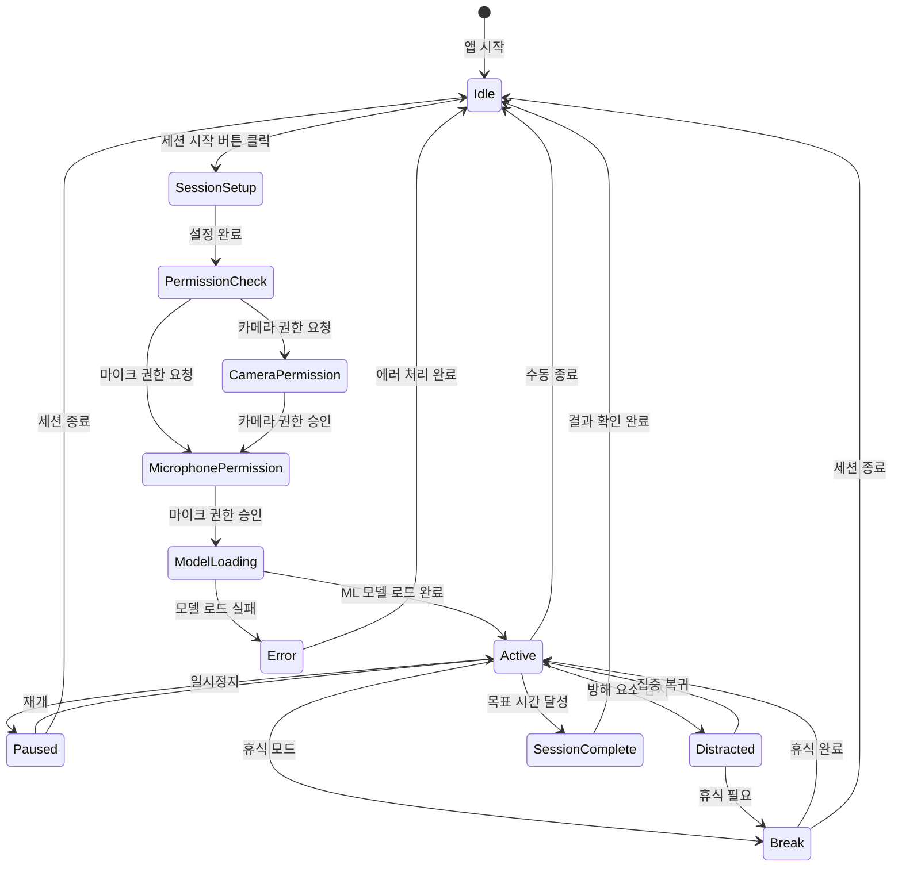
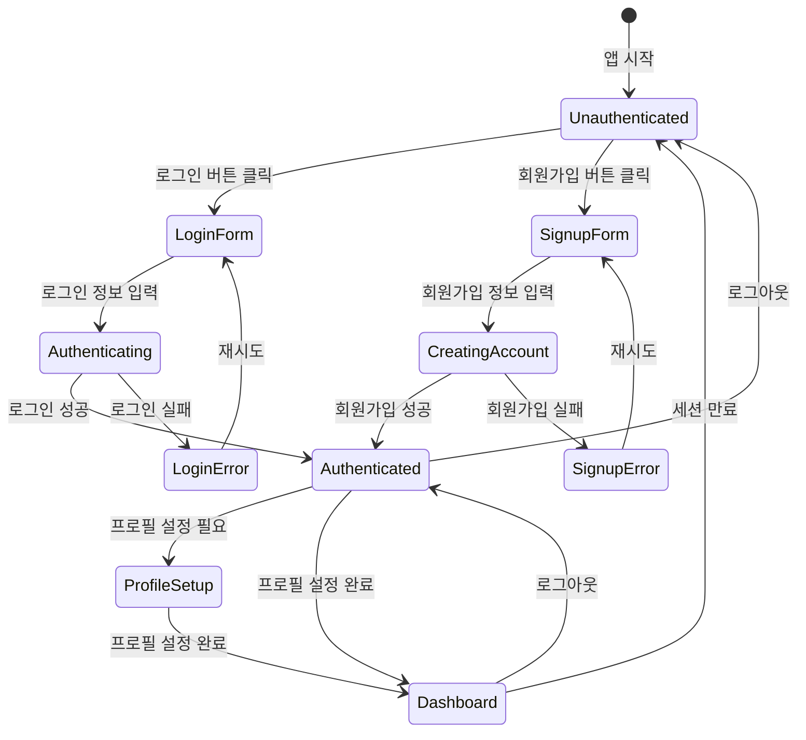
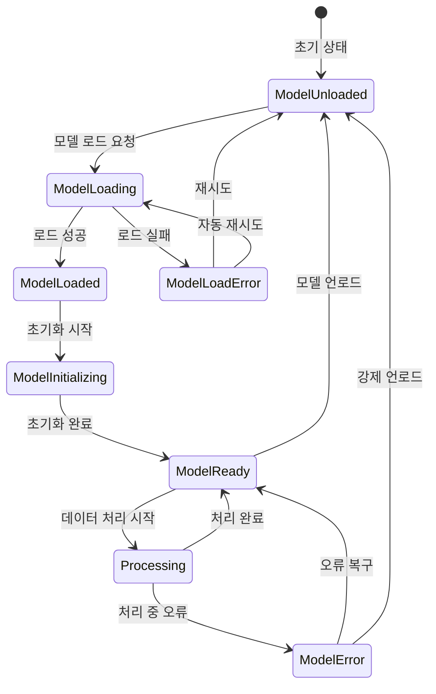
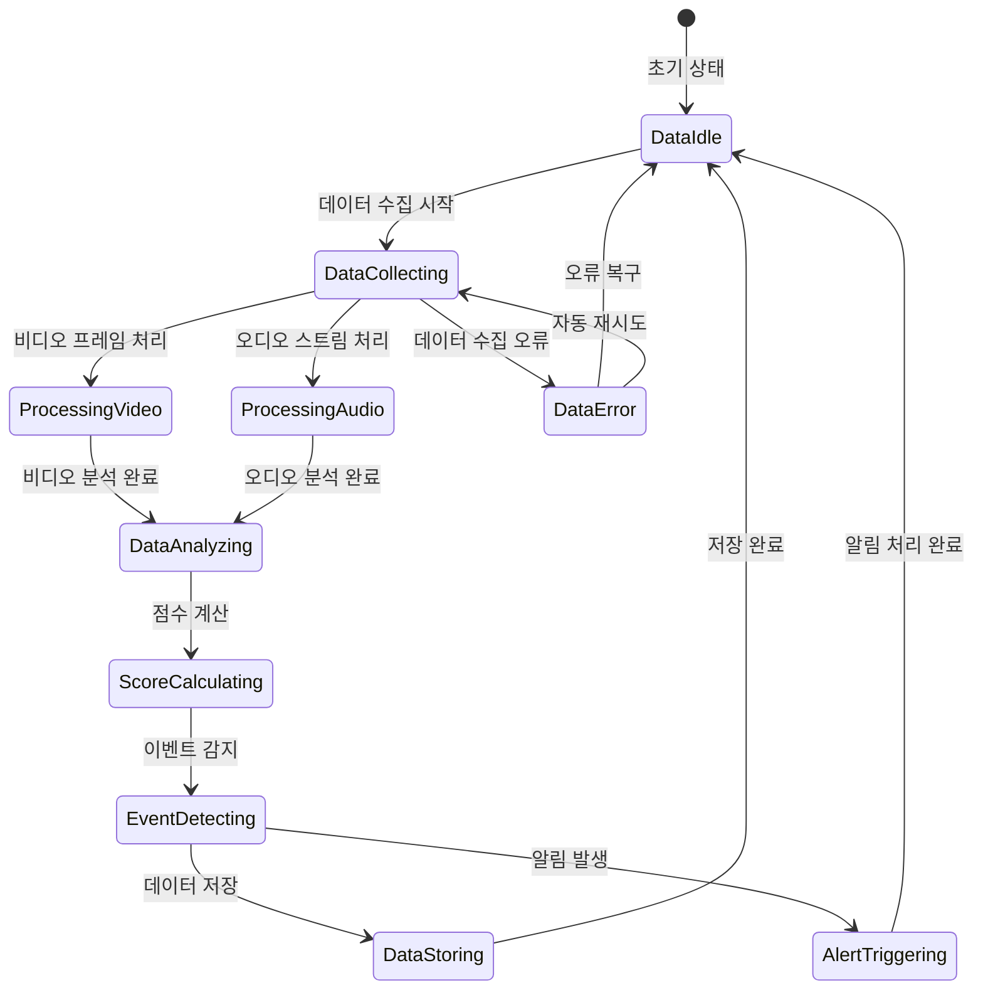
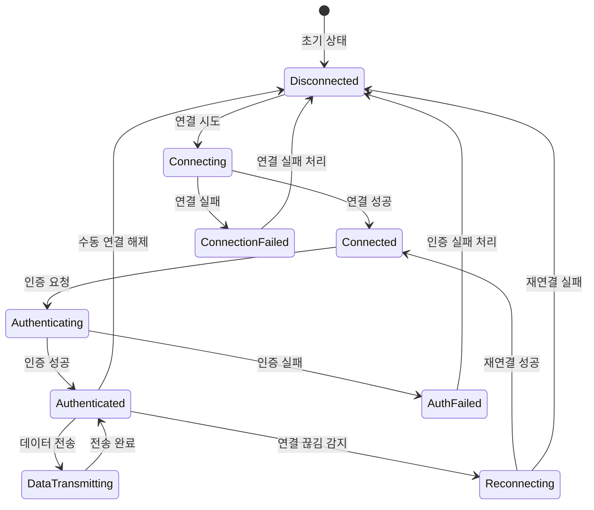
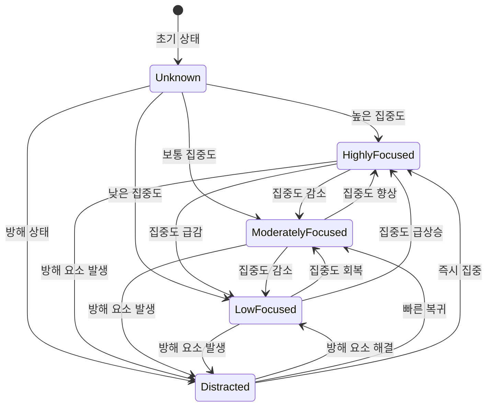
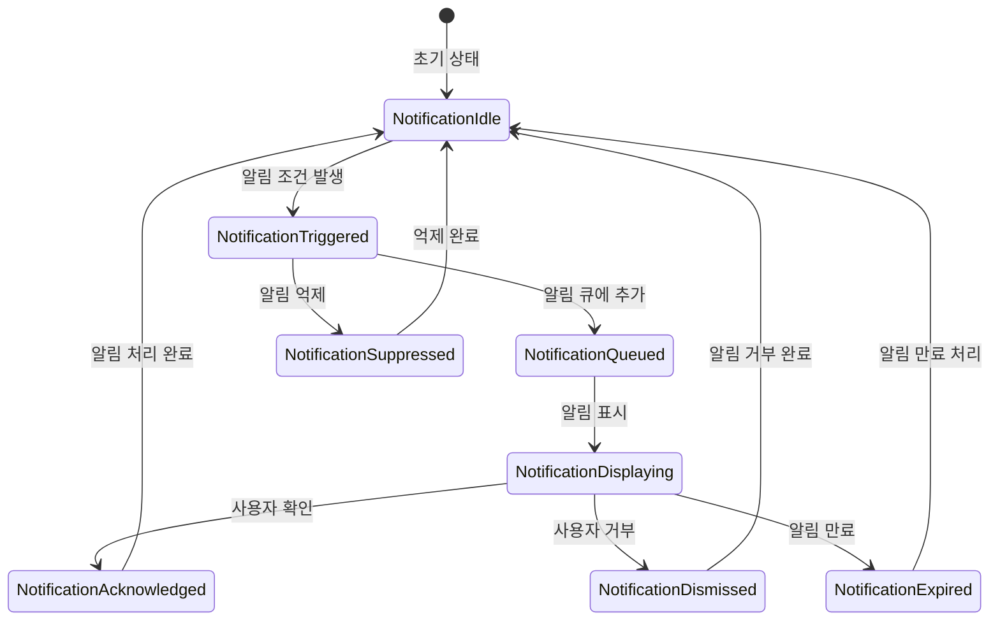
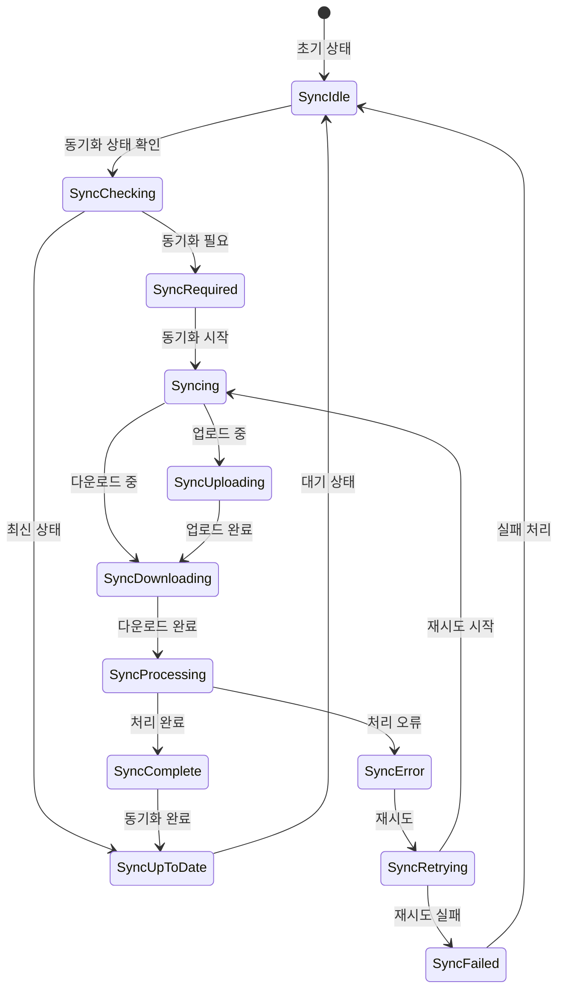
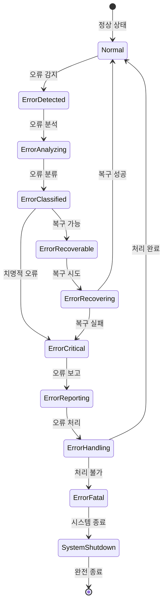
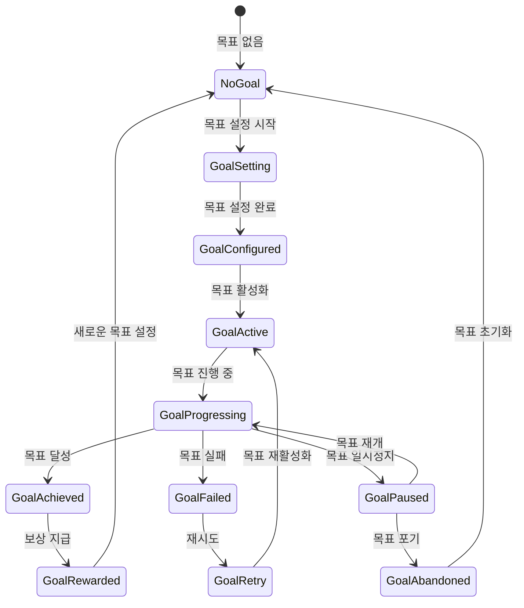

# FocusAI 상태 머신 다이어그램

## 1. 집중 세션 상태 머신

## 2. 사용자 인증 상태 머신

## 3. ML 모델 상태 머신

## 4. 실시간 데이터 처리 상태 머신

## 5. 웹소켓 연결 상태 머신

## 6. 사용자 집중도 상태 머신

## 7. 알림 시스템 상태 머신

## 8. 데이터 동기화 상태 머신

## 9. 에러 처리 상태 머신

## 10. 사용자 목표 설정 상태 머신

## 사용 방법

### 1. Mermaid Live Editor에서 확인
- https://mermaid.live/ 접속
- 위의 코드를 복사하여 붙여넣기
- 실시간으로 상태 머신 확인

### 2. GitHub/GitLab에서 렌더링
- 마크다운 파일에 직접 작성
- 자동으로 상태 머신 렌더링

### 3. VS Code에서 미리보기
- Mermaid Preview 확장 설치
- 실시간 미리보기 가능

## 상태 머신 활용 방법

### 1. 개발 단계
- **상태 정의**: 각 상태의 명확한 정의
- **전이 조건**: 상태 간 전환 조건 명시
- **에러 처리**: 예외 상황 처리 방법

### 2. 테스트 단계
- **상태 테스트**: 각 상태별 동작 검증
- **전이 테스트**: 상태 전환 로직 검증
- **에러 테스트**: 오류 상황 처리 검증

### 3. 문서화
- **개발자 문서**: 시스템 동작 방식 설명
- **사용자 가이드**: 사용자 경험 설명
- **유지보수 가이드**: 문제 해결 방법

## 추가 개선 사항

### 1. 상태 머신 확장
- 더 세분화된 상태 추가
- 복잡한 전이 조건 구현
- 병렬 상태 처리

### 2. 모니터링 연동
- 상태 변화 로깅
- 성능 메트릭 수집
- 알림 시스템 연동

### 3. 시각화 개선
- 상태별 색상 구분
- 전이 조건 표시
- 실시간 상태 표시 